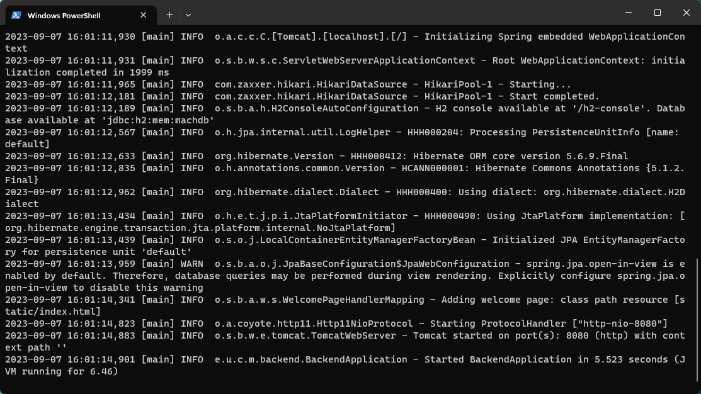

# Import Excel Manual

version 0.0.1

Please read [CSV Manual](https://github.com/Heisenberg-Y/MCN-DECOMPILE/blob/master/MANUAL.md) before reading this document.

## Environment

* Java Runtime Environment (JRE)
* Flash Emulator

## Download Links

* Backend + Frontend Bundle: [Releases Page](https://github.com/Heisenberg-Y/MachSyncBackend/releases)

* Machinations SWF File: [Releases Page](https://github.com/Heisenberg-Y/MCN-DECOMPILE/releases)

## Get Started

### Run the Programs

* Install Java on your computer: Follow the [instructions](https://www.java.com/en/download/manual.jsp) on the official website. Use the command `java -version` in your terminal to check the version and ensure it is correctly installed.

* Download the **Backend + Frontend Bundle**. In the folder containing the JAR file you just downloaded, run `java -jar backend-[version number]-SNAPSHOT.jar` in your terminal. A successfully initialized server should appear as follows, and you should find a log message stating "Started BackendApplication in x.xxx seconds":

  <p align="center">
    
  </p>

* Use your Flash Emulator to open the Machinations SWF file.

### Configure the file Watcher

* Open a browser page and visit [http://localhost:8080/](http://localhost:8080/), the web page should appear like this:

  <p align="center">
    
  </p>


* In the first block, provide a name for your configuration.

* In the second block, enter the absolute path to your Excel file(both xlsx and xlsm formats are supported), ensuring that the path follows the format:

  Windows:
  ```
  F:\Path\To\Target\File\target.xlsx
  ```

  Linux:
  ```
  /Path/To/Target/File/target.xlsx
  ```

  For the detailed structure and rules of the Excel file, please visit the [CSV Manual](https://github.com/Heisenberg-Y/MCN-DECOMPILE/blob/master/MANUAL.md). Overall, in CSV file we use commas to separate `Identifier`, `Attribute` and `Value`, in Excel we can just fill them in the first 3 blocks of each line. For example:

  <p align="center">
    
  </p>

* In the third block, enter the sheet number you want to import. The number starts from 0, which means if you want to import the third sheet in this Excel file, you should enter `2`.

  This feature gives you the opportunity to utilize your existing Excel file to change the parameters in Machinations. All you need to do is to create a new sheet in your excel file and use Excel formula `=Sheet1!A1` to copy value from blocks in other data sheets.

* Click the `Submit` button.

* Once your configuration showed up in the File Watcher list, activate it by clicking the `Activated` switch. After doing this, your web page should look like:

  <p align="center">
    
  </p>

### Pull the Data

* In Machinations, assign unique `Identifiers` to the elements or modals you wish to modify. For connections, modify their `Captions` and for elements, modify their `Labels`. Just like:

  <p align="center">
    
  </p>

  The use of `*` in your `Identifiers` is no longer permitted; it's a deprecated feature and will prevent your `Artificial Player` from recognizing elements.

* Click the `Remote` button and wait for the parameters to be modified **:)**

* You can leave the `Remote` button open, so that when you make changes to the Excel file, you can receive updates in Machinations.